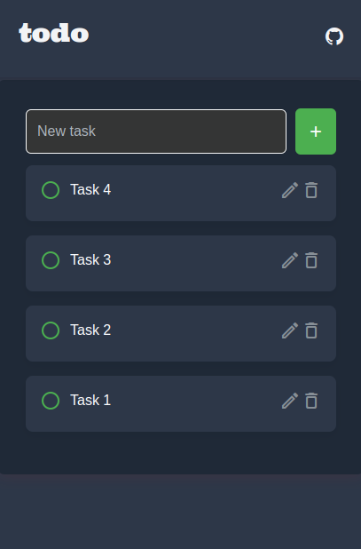
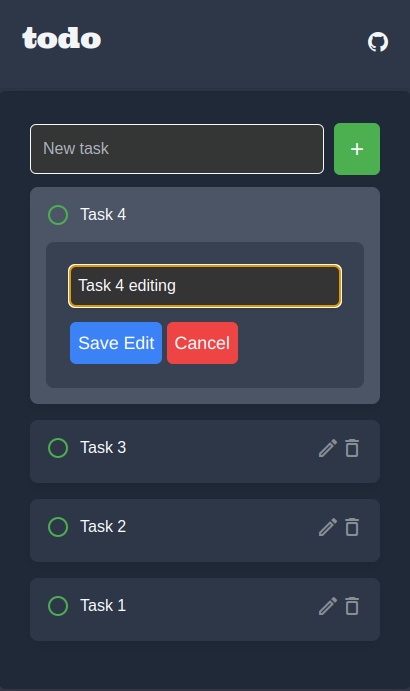

Standard Todo App (React Version)
Created using React, Node.js, and MongoDB  
Deployed on Render.com
Frontend: https://reactversion-yetanothertodoapp-1.onrender.com/ 
# Standard Todo App (React Version)

Created using React, Node.js, and MongoDB  
## Deployed on Render.com  
- **Frontend**: [https://reactversion-yetanothertodoapp-1.onrender.com/](https://reactversion-yetanothertodoapp-1.onrender.com/)  
- **Backend**: [https://reactversion-yetanothertodoapp.onrender.com/](https://reactversion-yetanothertodoapp.onrender.com/)  

<table>
  <tr>
    <td>
      
      <p align="center"><em>Main task list-edit and delete options</em></p>
    </td>
    <td>
     
      <p align="center"><em>Editing view of the task list</em></p>
    </td>
  </tr>
</table>
# Yet Another Todo App (React Version)

A robust todo application built with React, Node.js, Express, and MongoDB. This project provides a web-based interface to manage tasks, including creation, editing, deletion, and completion tracking, with data persisted in a MongoDB Atlas database. Unlike the [vanilla JavaScript version](https://github.com/morpole/yet-another-todo-app), this version leverages React for a component-based frontend, separates the frontend and backend into distinct services on Render.com, and uses Axios for API requests. The UI is styled with Tailwind CSS and custom styles for a responsive experience.

## Key Differences from the Vanilla JavaScript Version

- **Frontend Framework**: Uses React for a component-based architecture, replacing the vanilla JavaScript, HTML, and DOM manipulation approach.
- **Deployment Structure**: Separates the frontend and backend into two services on Render.com (a **Static Site** for the frontend and a **Web Service** for the backend), unlike the single-service deployment in the vanilla version.
- **API Communication**: Utilizes Axios for HTTP requests to the backend, replacing the `fetch` API used in the vanilla version.
- **State Management**: Leverages React’s `useState` and `useEffect` hooks for state management and lifecycle handling, instead of manual DOM updates.
- **CORS Handling**: Implements CORS on the backend to allow cross-origin requests from the separate frontend domain, which wasn’t needed in the single-service vanilla version.
- **Testing**: The vanilla version includes Vitest unit tests, but this React version currently does not include frontend tests (future enhancement planned).

## Features

- **Task Management**: Add, edit, delete, and mark tasks as complete.
- **Persistent Storage**: Tasks are stored in MongoDB Atlas for reliable data persistence.
- **Responsive UI**: Built with Tailwind CSS and custom styles for desktop and mobile compatibility.
- **Real-time Updates**: Tasks reload dynamically after CRUD operations using React state management.
- **Separate Frontend and Backend**: Frontend and backend are deployed as separate services, communicating via RESTful API.

## Prerequisites

- Node.js (v16+ recommended) and npm installed.
- A MongoDB Atlas account with a connection URI (stored in a `.env` file in the backend).
- Git installed to clone this repository.
- A code editor (e.g., VS Code).
- Render.com account for deployment (optional, if deploying).

## Setup Instructions

### Clone the Repository

```bash
git clone https://github.com/morpole/reactversion_yetanothertodoapp.git
cd reactversion_yetanothertodoapp
```


## Backend Setup
- Navigate to the Backend Directory:

```bash
cd backend
```
- Install Backend Dependencies:
```bash
npm install
```
- Configure Environment:
Create a `.env` file in the backend directory:
```bash
MONGO_URI=your_mongodb_atlas_connection_string
PORT=5000
```
- Replace `your_mongodb_atlas_connection_string` with your actual MongoDB URI from Atlas.

- Run the Backend:
```bash
npm start
```
The backend will run on `http://localhost:5000`.

## Frontend Setup
- Navigate to the Frontend Directory:
```bash
cd ../frontend
```
- Install Frontend Dependencies:
```bash
npm install
```
- Configure Environment:
  + Create a .env file in the frontend directory:
```bash
REACT_APP_API_URL=http://localhost:5000
```
  + This points the frontend to the local backend. Update this to your deployed backend URL when deploying.

- Run the Frontend:
```bash
npm start
```
- Open `http://localhost:3000` in your browser to use the app.

## Deployment on Render.com
- Backend (Web Service)
- Create a new Web Service on Render.com.

- Set the Root Directory to backend.

- Set the Build Command to npm install.

- Set the Start Command to node server.js.

- Add the `MONGO_URI` environment variable in the Environment section.

- Deploy the service and note the backend URL (e.g., https://your-backend-name.onrender.com).

## Frontend (Static Site)
- Create a new Static Site on Render.com.

- Set the Root Directory to frontend.

- Set the Build Command to `npm install && npm run build`.

- Set the Publish Directory to `build`.

- Add the `REACT_APP_API_URL` environment variable in the Environment section, set to your backend URL (e.g., https://your-backend-name.onrender.com).

- Deploy the service.

## Usage
- Add a Task:
Enter a task description in the input field and click the "+" button.

- Edit a Task:
Click the edit icon (pencil) next to a task to open an edit form, update the description, and save.

- Delete a Task:
Click the delete icon (trash) to remove a task.

- Mark as Complete:
Click the completion button (circle/check) to toggle task completion status.

- View Tasks:
The task list updates automatically after any action using React state management.

## Code Explanation
- File: `backend/server.js`:
  + Initializes an Express app, sets up middleware (CORS, express.json()), and connects to MongoDB Atlas.

  + Listens on PORT (default 5000).

  + Includes CORS to allow requests from the separate frontend domain.

- File: `backend/routes/tasks.js`:
  + Defines RESTful API endpoints for tasks:
  `POST /api/tasks`: Creates a new task.

  `GET /api/tasks`: Retrieves all tasks.

  `PATCH /api/tasks/:id:` Updates a task (e.g., description or completion status).

  `DELETE /api/tasks/:id:` Deletes a task.

  + Difference: Uses `PATCH` instead of `PUT` for partial updates, unlike the vanilla version.

- File: `backend/models/task.js`:
  + Defines a Mongoose schema for tasks with a description field and optional completed status.

  + Same as the vanilla version.

- File: `frontend/src/App.js`:
  + Main React component handling task management.

  + Uses useState and useEffect for state management and fetching tasks on mount.

  + Makes API requests with Axios to the backend.

  + Difference: Replaces the vanilla JavaScript DOM manipulation in main.js with React components and state.

- File: `frontend/src/App.css`:
  + Custom styles for the UI, complementing Tailwind CSS.

  + Similar to the vanilla version but adjusted for React’s component structure.

## Learning Outcomes
- This project demonstrates:
- Building a full-stack web application with React, Node.js, and Express.

- Integrating MongoDB Atlas for data persistence.

- Separating frontend and backend into distinct services with RESTful API communication.

- Managing state and lifecycle in React using hooks (useState, useEffect).

- Handling CORS for cross-origin requests between separate domains.

- Deploying a React app and Node.js backend on Render.com as separate services.

